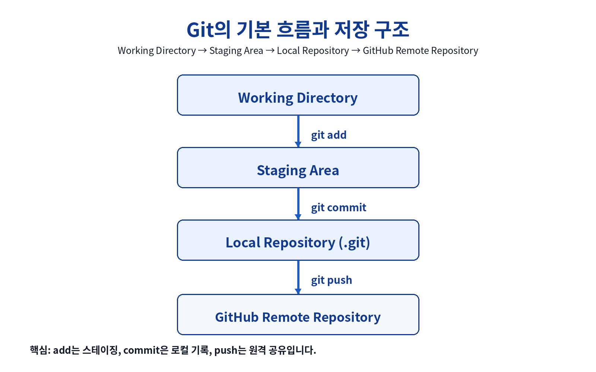
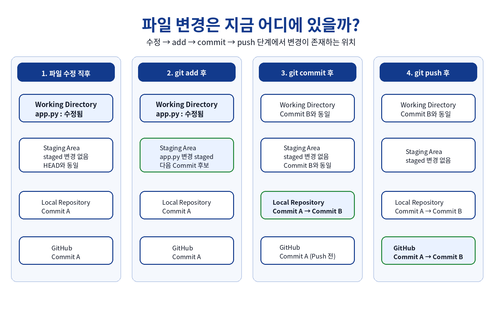
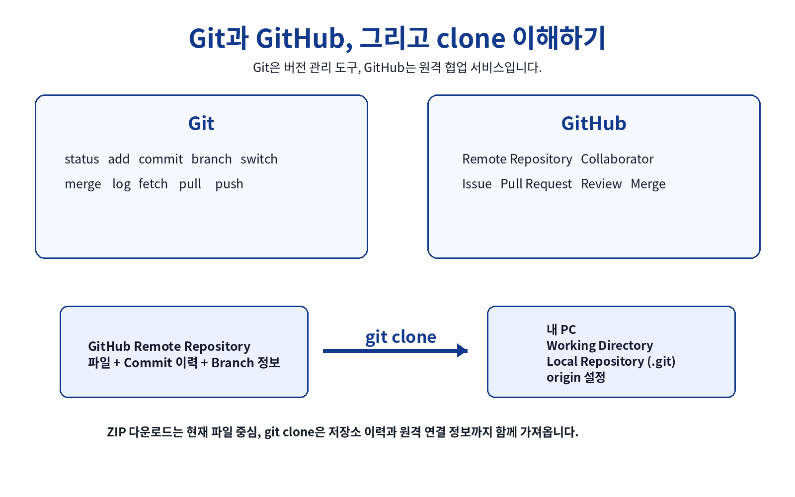
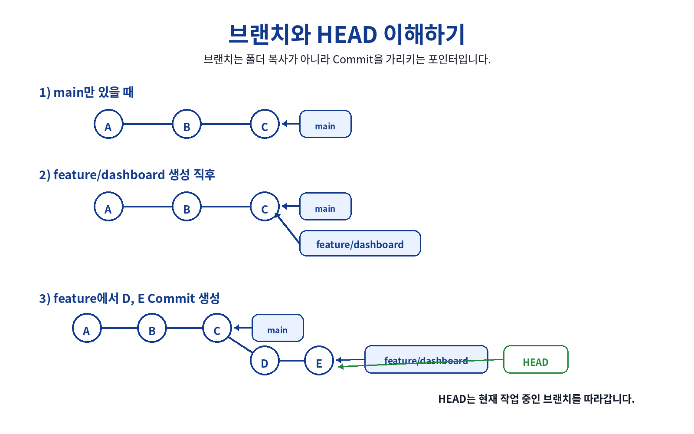
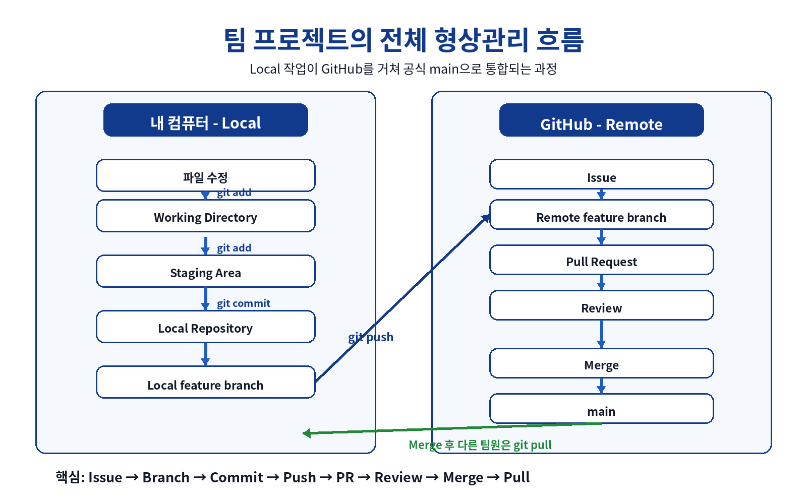
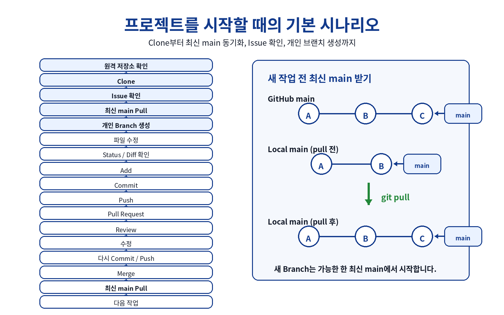
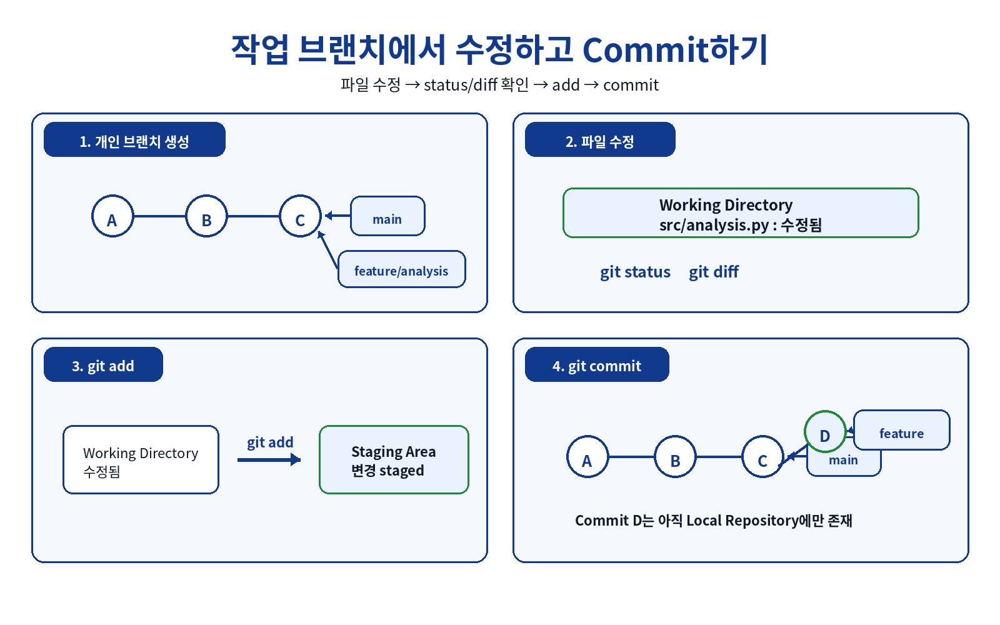
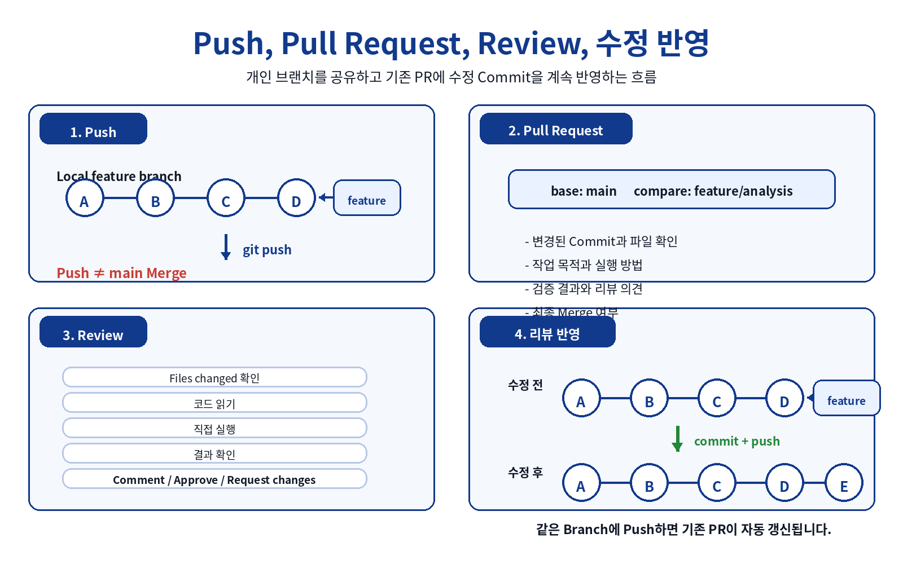
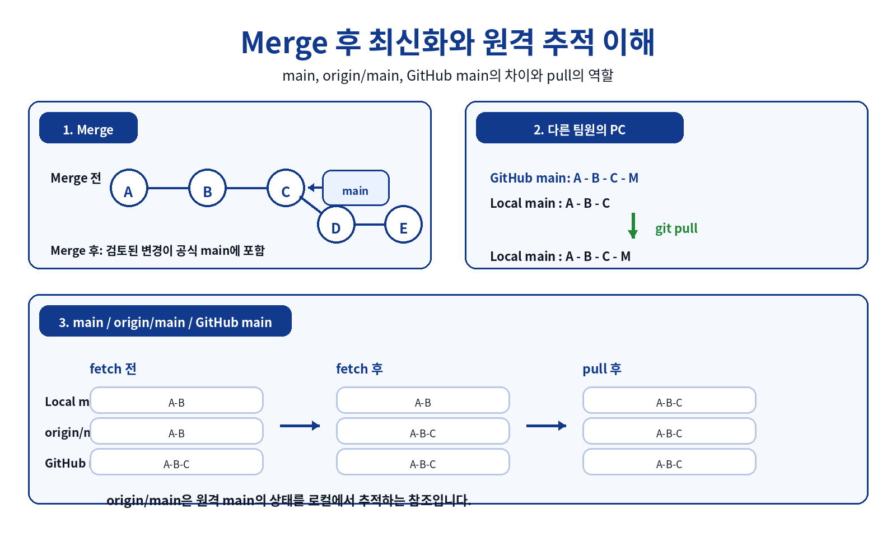
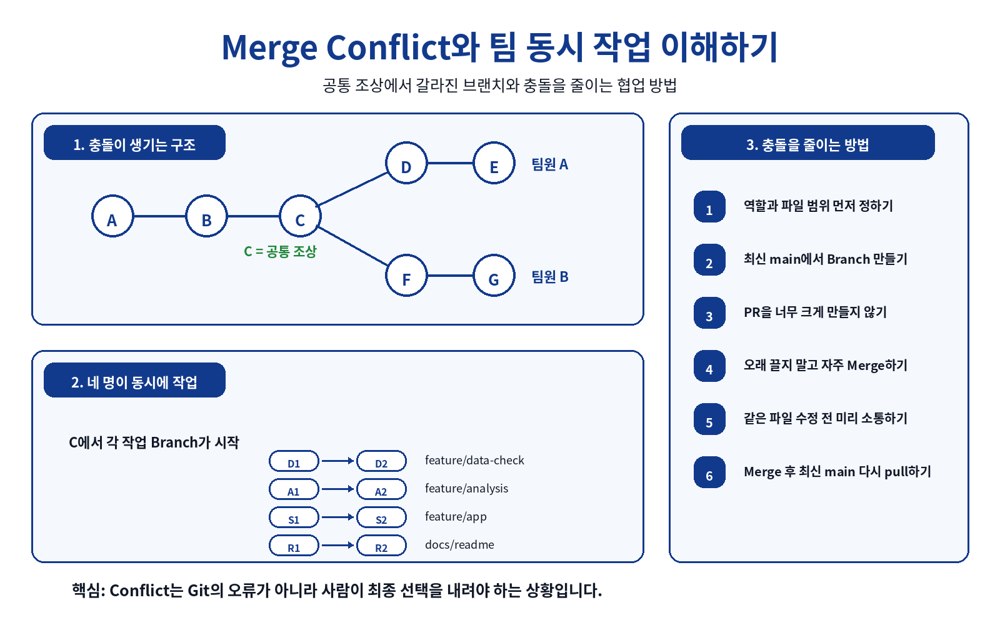

# 2장 통합 실습: GitHub 협업 프로젝트의 전체 흐름과 형상관리 이해하기

> **대상:** Git의 기본 동작을 학습한 초보자  
> **선행 학습:** 「1장 통합 실습: Git의 동작 원리와 안전한 저장소 시작」  
> **권장 환경:** Windows 10/11, PowerShell, Git, VS Code, GitHub  
> **예상 학습 시간:** 120~150분

---

## 이 글은 지난 1장의 후속 실습입니다

지난 1장에서는 한 사람의 컴퓨터 안에서 Git이 어떻게 동작하는지 학습했습니다.

가장 중요한 흐름은 다음과 같습니다.



지난 장의 핵심 흐름은 다음과 같습니다.

```text
Working Directory
       |
       | git add
       v
Staging Area
       |
       | git commit
       v
Local Repository
```

이번 장에서는 이 구조를 GitHub 원격 저장소와 팀 협업까지 확장합니다.

> **이번 장에서 계속 던질 질문:** 지금 내가 만든 변경은 어디에 있는가?

---

# 학습 목표

이 글을 마치면 다음을 설명할 수 있습니다.

1. 로컬 저장소와 원격 저장소의 차이를 설명할 수 있습니다.
2. Working Directory, Staging Area, Local Repository, Remote Repository의 관계를 설명할 수 있습니다.
3. `clone`, `add`, `commit`, `push`, `pull`이 각각 무엇을 바꾸는지 설명할 수 있습니다.
4. 브랜치가 프로젝트 폴더의 복사본이 아니라 Commit을 가리키는 포인터라는 것을 설명할 수 있습니다.
5. `main`과 개인 작업 브랜치를 구분하여 사용할 수 있습니다.
6. GitHub Issue와 Pull Request의 역할을 설명할 수 있습니다.
7. Pull Request → Review → 수정 → Merge의 협업 흐름을 설명할 수 있습니다.
8. Merge 후 팀원들이 왜 다시 `pull`해야 하는지 설명할 수 있습니다.
9. Merge Conflict가 발생하는 이유를 구조적으로 설명할 수 있습니다.
10. 팀 프로젝트의 전체 형상관리 프로세스를 하나의 흐름으로 설명할 수 있습니다.

---

# 1. 가장 먼저 이해할 네 개의 공간

Git 협업을 이해하려면 다음 네 공간을 구분해야 합니다.

- **Working Directory**: 실제 파일을 수정하는 곳
- **Staging Area**: 다음 Commit에 포함할 변경을 선택해 두는 곳
- **Local Repository**: 내 PC에 Commit 이력이 저장되는 곳
- **Remote Repository**: GitHub에서 팀과 Commit 이력을 공유하는 곳

중요한 점은 `git add`, `git commit`만으로 GitHub에 파일이 올라가는 것이 아니라는 것입니다.

```text
파일 수정
-> git add
-> git commit
-> git push
```

`git commit`까지는 기본적으로 내 PC 안의 저장소에서 일어나고, GitHub에 공유하려면 `git push`가 필요합니다.

---

# 2. 파일 변경은 지금 어디에 있을까?

초보자가 가장 많이 혼동하는 부분입니다.



예를 들어 `app.py`를 수정했다고 가정합니다.

## 2.1 파일을 수정한 직후

- 수정 내용은 Working Directory에 있습니다.
- Staging Area에는 새로 staged된 변경이 없습니다.
- Local Repository에는 아직 이전 Commit만 있습니다.
- GitHub도 이전 상태입니다.

## 2.2 `git add app.py` 후

```powershell
git add app.py
```

- `app.py`의 현재 변경이 Staging Area에 staged 됩니다.
- 아직 새로운 Commit은 생성되지 않았습니다.
- GitHub도 바뀌지 않습니다.

## 2.3 `git commit` 후

```powershell
git commit -m "feat: update dashboard"
```

- 새로운 Commit이 Local Repository에 만들어집니다.
- Working Directory와 Staging Area는 현재 Commit과 같은 상태가 됩니다.
- 새로 staged된 변경은 없습니다.
- 아직 Push 전이므로 GitHub는 바뀌지 않습니다.

> Staging Area를 단순히 “비어 있다”라고 외우기보다 **새로 staged된 변경이 없다**라고 이해하는 것이 더 정확합니다.

## 2.4 `git push` 후

```powershell
git push
```

Local Repository의 Commit이 GitHub Remote Repository에 공유됩니다.

---

# 3. Git과 GitHub, 그리고 clone 이해하기



Git과 GitHub는 같은 것이 아닙니다.

## Git

Git은 버전 관리 도구입니다.

대표 명령은 다음과 같습니다.

```text
status
add
commit
branch
switch
merge
log
fetch
pull
push
```

## GitHub

GitHub는 Git 저장소를 온라인에서 공유하고 협업할 수 있도록 도와주는 서비스입니다.

대표 협업 기능은 다음과 같습니다.

```text
Remote Repository
Collaborator
Issue
Pull Request
Review
Merge
```

## `git clone`은 무엇을 가져올까?

```powershell
git clone <팀 저장소 URL>
```

`clone`은 단순한 파일 다운로드가 아닙니다.

- 현재 프로젝트 파일
- Git Commit 이력
- Branch 정보
- 원격 저장소 연결 정보(`origin`)

등을 포함한 Git 저장소를 내 PC에 준비합니다.

따라서 ZIP 다운로드와 `git clone`은 목적이 다릅니다.

---

# 4. 브랜치와 HEAD 이해하기



## 브랜치는 폴더 복사본이 아닙니다

브랜치는 특정 Commit을 가리키는 이름 또는 포인터입니다.

예를 들어 `main`이 Commit C를 가리킨다고 가정합니다.

```text
A --- B --- C                  <- main
```

새 브랜치를 만듭니다.

```powershell
git switch -c feature/dashboard
```

브랜치 생성 직후에는 `main`과 `feature/dashboard`가 같은 Commit C를 가리킵니다.

feature 브랜치에서 D와 E를 Commit하면 다음처럼 분기됩니다.

```text
A --- B --- C                  <- main
           \
            D --- E            <- feature/dashboard
```

## HEAD는 무엇인가?

HEAD는 보통 현재 작업 중인 브랜치를 가리킵니다.

현재 브랜치를 확인합니다.

```powershell
git branch --show-current
```

새 Commit을 만들면 현재 브랜치 포인터가 앞으로 이동하고 HEAD도 그 브랜치를 따라갑니다.

---

# 5. 팀 프로젝트의 전체 형상관리 흐름



팀 프로젝트에서는 다음 과정이 하나의 반복 작업이 됩니다.

```text
Issue
-> 최신 main 확인
-> 개인 Branch
-> 파일 수정
-> add
-> commit
-> push
-> Pull Request
-> Review
-> 수정
-> commit / push
-> Merge
-> pull
```

형상관리 관점에서 보면 다음 질문을 관리하는 과정입니다.

| 질문 | 사용 기능 |
|---|---|
| 무엇을 바꿀 것인가? | Issue |
| 누가 담당하는가? | Issue 담당자 / 역할 분담 |
| 어디에서 독립적으로 작업하는가? | Branch |
| 어떤 변경을 기록했는가? | Commit |
| 팀에 어떻게 공유하는가? | Push |
| 왜 바꾸었는가? | Pull Request 설명 |
| 누가 확인하는가? | Review |
| 공식 버전에 어떻게 포함하는가? | Merge |
| 최신 공식 버전을 어떻게 받는가? | Pull |

이번 프로젝트에서는 `main`을 **팀이 검토하고 통합한 현재의 공식 프로젝트 버전**으로 이해합니다.

---

# 6. 프로젝트를 시작할 때의 기본 시나리오



전체 시작 순서는 다음과 같습니다.

```text
원격 저장소 확인
-> Clone
-> Issue 확인
-> 최신 main Pull
-> 개인 Branch 생성
-> 작업 시작
```

## 6.1 저장소 처음 받기

```powershell
cd C:\dev
git clone <팀 저장소 URL>
cd <저장소명>
```

확인합니다.

```powershell
git status
git log --oneline -5
git branch
git remote -v
```

## 6.2 Issue 확인

Issue는 Git의 Staging Area나 `.git` 내부에 저장되는 작업 파일이 아닙니다.

GitHub에서 다음 내용을 관리하는 협업 기록입니다.

- 작업 목적
- 담당자
- 체크리스트
- 완료 조건
- 관련 PR

## 6.3 새 작업 전 최신 main 받기

```powershell
git switch main
git pull origin main
```

내 PC의 `main`이 오래된 상태라면 새 Branch도 오래된 코드에서 출발하게 됩니다.

따라서 **새 작업은 가능한 한 최신 main에서 시작**하는 습관이 중요합니다.

---

# 7. 작업 브랜치에서 수정하고 Commit하기



## 7.1 개인 브랜치 생성

```powershell
git switch -c feature/analysis-metrics
```

확인합니다.

```powershell
git branch --show-current
```

## 7.2 파일 수정

예를 들어 다음 파일을 수정합니다.

```text
src/analysis.py
```

## 7.3 변경 내용 확인

```powershell
git status
git diff
```

`status`는 변경 상태를 확인하고, `diff`는 실제로 무엇이 바뀌었는지를 확인합니다.

## 7.4 Staging

```powershell
git add src/analysis.py
```

다음 Commit에 포함할 변경을 선택합니다.

## 7.5 Commit

```powershell
git commit -m "feat: add category sales calculation"
```

새 Commit은 먼저 **Local Repository**에 생성됩니다.

이 시점에는 아직 GitHub에 없을 수 있습니다.

---

# 8. Push, Pull Request, Review, 수정 반영



## 8.1 처음 Push

```powershell
git push -u origin feature/analysis-metrics
```

이후 같은 브랜치에서는 보통 다음처럼 실행할 수 있습니다.

```powershell
git push
```

중요합니다.

> **Push했다고 main에 합쳐진 것이 아닙니다.**

개인 Branch가 GitHub Remote Repository에 공유된 것입니다.

## 8.2 Pull Request 생성

예:

```text
base: main
compare: feature/analysis-metrics
```

PR에는 다음을 기록합니다.

- 작업 목적
- 주요 변경 내용
- 실행 방법
- 검증 방법과 결과
- 관련 Issue

## 8.3 다른 팀원의 Review

리뷰는 코드를 보기만 하는 것이 아닙니다.

가능하면 다음 순서로 확인합니다.

```text
Files changed 확인
-> 코드 읽기
-> 실행 방법 확인
-> 직접 실행
-> 결과 확인
-> Comment / Approve / Request changes
```

## 8.4 리뷰 받은 코드 수정

기존 Branch에서 수정 후 다시 Commit하고 Push하면 됩니다.

```powershell
git add src/analysis.py
git commit -m "fix: handle empty category result"
git push
```

새 Pull Request를 다시 만들 필요는 없습니다.

같은 Branch에 새 Commit을 Push하면 **기존 PR이 자동으로 갱신**됩니다.

---

# 9. Merge 후 최신화와 원격 추적 이해



## 9.1 Review 완료 후 Merge

Merge 전에는 `main`과 개인 Branch가 서로 다른 Commit을 가리킬 수 있습니다.

검토가 끝난 변경을 Merge하면 공식 `main`에 포함됩니다.

상황에 따라 Merge Commit이 만들어질 수도 있고 Fast-forward 형태가 될 수도 있습니다.

초보자 단계에서는 다음을 기억하면 충분합니다.

> **검토가 끝난 기능이 main의 공식 이력에 포함된다.**

## 9.2 GitHub에서 Merge했다고 내 PC가 자동으로 바뀌는 것은 아닙니다

다른 팀원의 Local Repository는 여전히 이전 상태일 수 있습니다.

따라서 다시 최신화합니다.

```powershell
git switch main
git pull origin main
```

## 9.3 `main`, `origin/main`, GitHub main 구분

- `main`: 내 Local Repository의 로컬 브랜치
- `origin/main`: 내가 마지막으로 가져온 원격 `main` 상태를 나타내는 로컬의 원격 추적 참조
- GitHub main: 실제 GitHub Remote Repository의 `main`

`git fetch`는 원격의 최신 정보를 가져오지만 Local `main`을 자동으로 최신 Commit까지 이동시키지는 않습니다.

`git pull`은 원격 변경을 받아 현재 Local Branch에 반영하는 과정입니다.

---

# 10. Merge Conflict와 팀 동시 작업 이해하기



Git 충돌은 Git 프로그램의 고장이 아닙니다.

서로 다른 변경 중 무엇을 최종 결과로 사용할지 Git이 자동으로 결정하기 어려워 **사람의 판단이 필요한 상태**입니다.

## 10.1 충돌이 생기는 구조

두 사람이 같은 공통 Commit C에서 출발했다고 가정합니다.

```text
                 D --- E       <- team A
                /
A --- B --- C
                \
                 F --- G       <- team B
```

같은 파일의 같은 부분을 서로 다르게 수정했다면 Git이 자동으로 선택하기 어려울 수 있습니다.

## 10.2 네 명이 동시에 작업할 때

팀원별로 Branch를 분리합니다.

```text
feature/data-check
feature/analysis
feature/app
docs/readme
```

각 Branch에서 독립적으로 작업한 뒤 PR과 Review를 거쳐 main에 통합합니다.

## 10.3 충돌을 줄이는 방법

1. 역할과 파일 범위를 먼저 정합니다.
2. 항상 최신 main에서 Branch를 만듭니다.
3. PR을 너무 크게 만들지 않습니다.
4. 오랫동안 혼자 작업한 뒤 한 번에 Merge하지 않습니다.
5. 같은 파일을 수정할 때 미리 소통합니다.
6. Merge 후 최신 main을 다시 Pull합니다.

---

# 11. 명령어별 어디가 바뀌는지 정리

| 명령 | 핵심 역할 |
|---|---|
| 파일 직접 수정 | Working Directory 변경 |
| `git status` | 현재 변경 상태 조회 |
| `git diff` | 변경 내용 비교 |
| `git add` | 다음 Commit 대상 선택 |
| `git commit` | Local Repository에 새 기록 생성 |
| `git switch` | 현재 작업 Branch 변경 |
| `git branch` | Branch 정보 확인/생성 |
| `git push` | Local Commit을 Remote에 공유 |
| `git fetch` | 원격 최신 정보 가져오기 |
| `git pull` | 원격 변경을 Local Branch에 반영 |
| Pull Request | GitHub에서 변경 검토 요청 |
| Review | 다른 팀원이 변경 확인 |
| Merge | 승인된 변경을 main에 통합 |

---

# 12. GitHub 협업에서 자주 하는 오해

## 오해 1. `git add`하면 GitHub에 올라간다

아닙니다. Staging Area에 다음 Commit 후보로 선택하는 과정입니다.

## 오해 2. `git commit`하면 다른 팀원이 바로 볼 수 있다

아닙니다. Commit은 먼저 Local Repository에 생성됩니다. 원격에 공유하려면 Push가 필요합니다.

## 오해 3. 개인 Branch를 Push하면 main에 자동 반영된다

아닙니다. Push는 Branch를 공유한 것이며 PR과 Review를 거쳐 Merge해야 합니다.

## 오해 4. `git pull`과 Pull Request는 같은 개념이다

아닙니다.

- `git pull`: 원격 변경을 Local로 가져오는 Git 명령
- Pull Request: Branch 변경을 검토하고 통합하기 위한 GitHub 협업 기능

## 오해 5. GitHub에서 Merge하면 모든 팀원의 PC도 자동 변경된다

아닙니다. 각 팀원이 필요할 때 `pull`해야 합니다.

## 오해 6. Branch는 프로젝트 폴더를 하나 더 복사한 것이다

아닙니다. Branch는 Commit을 가리키는 포인터입니다.

---

# 13. 작업 중 길을 잃었을 때 확인할 명령

무작정 명령을 실행하기보다 먼저 현재 상태를 확인합니다.

```powershell
pwd
git status
git branch --show-current
git log --oneline --decorate --graph -10
git remote -v
```

각 질문은 다음과 같습니다.

- `pwd`: 나는 어느 폴더에 있는가?
- `git status`: 어떤 파일이 변경되었는가?
- `git branch --show-current`: 어느 Branch에서 작업 중인가?
- `git log`: Commit 이력이 어떻게 이어져 있는가?
- `git remote -v`: 어느 GitHub 저장소와 연결되어 있는가?

---

# 14. 최종 실습 체크리스트

## 저장소와 작업 시작

- [ ] 팀 GitHub 저장소에 접근할 수 있다.
- [ ] `git remote -v`로 `origin`을 확인했다.
- [ ] Issue를 확인하거나 만들었다.
- [ ] `main`으로 이동했다.
- [ ] 최신 `main`을 Pull했다.
- [ ] 개인 Branch를 생성했다.

## 파일 작업

- [ ] 담당 파일을 수정했다.
- [ ] `git status`를 확인했다.
- [ ] `git diff`를 확인했다.
- [ ] 필요한 변경만 `git add`했다.
- [ ] 의미 있는 Commit을 만들었다.

## 원격 공유와 리뷰

- [ ] 개인 Branch를 Push했다.
- [ ] Pull Request를 만들었다.
- [ ] 다른 팀원의 PR을 리뷰했다.
- [ ] 리뷰 의견을 반영했다.
- [ ] 수정 후 Commit과 Push를 다시 수행했다.

## 통합

- [ ] Review 완료 후 Merge했다.
- [ ] `main`으로 이동했다.
- [ ] 최신 `main`을 Pull했다.
- [ ] 전체 프로젝트를 다시 실행했다.

---

# 15. 이번 장의 핵심 정리

지난 1장의 흐름은 다음과 같았습니다.

```text
Working Directory
-> Staging Area
-> Local Repository
```

이번 장에서는 팀 협업까지 확장했습니다.

```text
Working Directory
-> Staging Area
-> Local Repository
-> Remote feature branch
-> Pull Request
-> Review
-> Merge
-> Remote main
-> Local main
```

그리고 프로젝트 전체 흐름은 다음과 같습니다.

```text
Issue
-> Branch
-> 수정
-> Add
-> Commit
-> Push
-> Pull Request
-> Review
-> 수정 / 추가 Commit
-> Merge
-> Pull
-> 다음 작업
```

명령어 자체를 외우는 것보다 다음 질문을 계속 확인하는 것이 중요합니다.

> **지금 내가 만든 변경은 어디에 있는가?**

---

# 네이버 블로그 태그

#Git #GitHub #Git초보 #Git협업 #형상관리 #브랜치 #PullRequest #코드리뷰 #Merge #팀프로젝트
